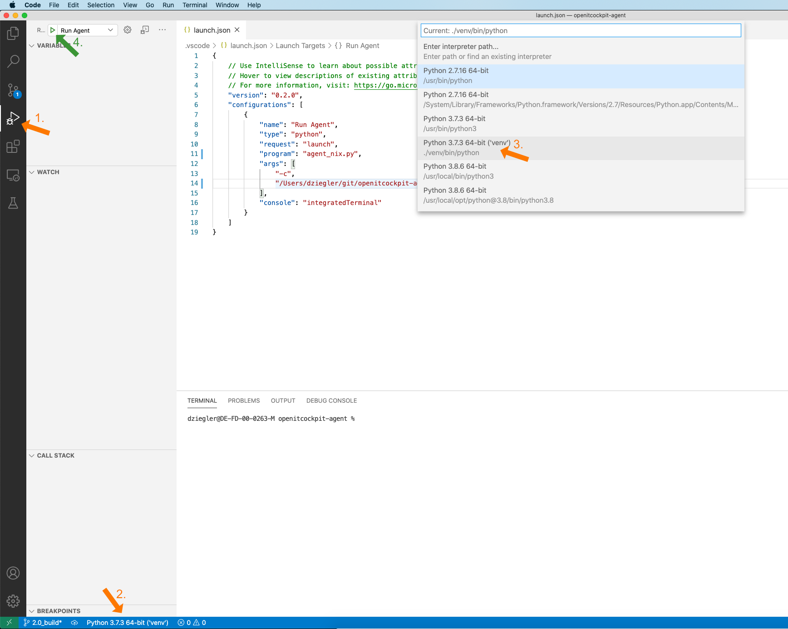

# openitcockpit-agent 2.0
Cross-Platform Monitoring Agent for openITCOCKPIT

1. [Installation](#Installation)
2. [Usage](#Usage)
3. [Sample files](#Sample-files)
4. [Agent build instructions](#Agent-build-instructions)
5. [Export documentation as html](#Export-documentation-as-html)

---

Customer documentation: [https://docs.it-novum.com/display/ODE/openITCOCKPIT+Agent](https://docs.it-novum.com/display/ODE/openITCOCKPIT+Agent)

---

## Installation

## Productive installation

Require glibc >= 2.17

Supported & tested systems:
- macOS 10.14 (Mojave), 10.15 (Catalina)
- Ubuntu 14, 16, 18, 20
- Debian 8, 9, 10
- openSUSE Leap 42.3
- CentOS 7
- Arch Linux (2019.08.01)
- Windows 8.1, Windows 10, Windows Server 2016, Windows Server 2019


### Packages

Please visit the [release page](https://github.com/it-novum/openitcockpit-agent/releases) to download the latest or older versions.

#### Debian / Ubuntu

Install: `sudo apt install ./openitcockpit-agent_*_amd64.deb`

Uninstall: `sudo apt remove openitcockpit-agent`

#### Arch

Install: `sudo pacman -U openitcockpit-agent-*-x86_64.pkg.tar.xz`

Uninstall: `sudo pacman -R openitcockpit-agent`

#### centOS / openSUSE

Install:  `rpm -i openitcockpit-agent-*.x86_64.rpm`

Uninstall:  `rpm -e openitcockpit-agent`

#### macOS

Install `sudo installer -pkg openitcockpit-agent-1.*.pkg -target / -verbose`

Uninstall `sudo installer -pkg openitcockpit-agent-uninstaller*.pkg -target / -verbose`

#### Windows

Install with double clicking the msi installer file.

Automated install:  `msiexec.exe /i openitcockpit-agent.msi INSTALLDIR="C:\Program Files\it-novum\openitcockpit-agent\" /qn`

Uninstall using the windows built-in graphical package manager.


## Developer installation

1. Clone this repository
```
git clone https://github.com/it-novum/openitcockpit-agent.git
cd openitcockpit-agent/
```

2. Create new Python virtual environment
```
python3 -m venv ./venv
. ./venv/bin/activate
```

3. Install dependencies on Linux or macOS
```
pip install -r requirements.txt
```

3. Install dependencies on Windows
```
pip install -r requirements.txt servicemanager pywin32
```

4. Copy example config
```
cp example_config.cnf config.cnf
```

### Visual Studio Code 

Free Download: [https://code.visualstudio.com/](https://code.visualstudio.com/)

#### Plugins
 - [Python extension for Visual Studio Code](https://marketplace.visualstudio.com/items?itemName=ms-python.python)

#### Setup Debugger


### PyCharm Community 

Free Download: [https://www.jetbrains.com/pycharm/download/](https://www.jetbrains.com/pycharm/download/)

#### Setup Debugger


---

## Usage

Default: ```python agent.py```

Custom: ```python oitc_agent.py -v -i <check interval seconds> -p <port number> -a <ip address> -c <config path> --certfile <certfile path> --keyfile <keyfile path> --auth <user>:<password> --oitc-url <url> --oitc-apikey <api key> --oitc-interval <seconds>```

Windows: ```python.exe oitc_agent.py```

#### Pull mode (publish data as json threw a web server)

Default url to get check results: ```http://address:port```

Default url to get current configuration: ```http://address:port/config```


Options (script start parameters overwrite options in config file):

|option| value | description | 
| ------ | ------ | ----------- | 
|-i --interval       |seconds       |check interval in seconds     | 
|-p --port       |number       |webserver port number     | 
|-a --address       |ip address       |webserver ip address     | 
|-c --config       |config path       |config file path (absolute path recommended)     | 
|--customchecks       |file path       |custom check config file path (absolute path recommended)    | 
|--auth       |user:password       |enable http basic auth     | 
|-v --verbose       |       |enable verbose mode (information/errors without stackstrace)     | 
|-s --stacktrace       |       |print stackstrace for possible exceptions     | 
|--config-update-mode       |       |enable configuration update mode threw post request and /config to get current configuration     | 
|--temperature-fahrenheit       |       |set temperature to fahrenheit if enabled (else use celsius)     | 
|--dockerstats       |       |enable docker status check     | 
|--qemustats       |       |enable qemu status check (linux only)     | 
|--no-cpustats       |       |disable default cpu status check     | 
|--no-sensorstats       |       |disable default sensor status check     | 
|--no-processstats       |       |disable default process status check     | 
|--processstats-including-child-ids       |       |add process child ids to the default process status check (computationally intensive)     | 
|--no-netstats       |       |disable default network status check     | 
|--no-diskstats       |       |disable default disk status check     | 
|--no-netio       |       |disable default network I/O calculation     | 
|--no-diskio       |       |disable default disk I/O calculation     | 
|--no-winservices       |       |disable default windows services status check (windows only)    | 
|-h --help       |       |print a help message and exit     | 

Add there parameters to enable ssl encrypted http(s) server:

|option| value | description | 
| ------ | ------ | ----------- | 
|--certfile       |certfile path       |/path/to/cert.pem (absolute path recommended)    | 
|--keyfile       |keyfile path       |/path/to/key.pem (absolute path recommended)    | 
|--try-autossl       |       |try to enable auto webserver ssl mode    | 

File paths used for autossl (default: /etc/openitcockpit-agent/... or C:\Program Files\openitcockpit-agent\\...):

|option| value | description | 
| ------ | ------ | ----------- | 
|--autossl-csr-file       |file path       |/path/to/agent.csr (absolute path recommended)    | 
|--autossl-crt-file       |file path       |/path/to/agent.crt (absolute path recommended)    | 
|--autossl-key-file       |file path       |/path/to/agent.key (absolute path recommended)    | 
|--autossl-ca-file       |file path       |/path/to/server_ca.crt (absolute path recommended)    | 

Using ssl or autossl the URL change from http://address:port to https://address:port


Example:

You can create a self signed certificate and key file with this command

```
openssl req -nodes -new -x509 -keyout server.key -out server.cert
```

Create a .p12 file to import as certificate in your web browser (like Firefox) to be able to browse to the encrypted agent webserver
```
openssl req -nodes -new -x509 -keyout server.key -out server.cert
cat server.cert server.key > both.pem
openssl pkcs12 -export -in both.pem -out both.p12
```

#### Push mode (send data as post request to a url endpoint)

Add there parameters (all required) to enable transfer of check results to a openITCOCKPIT server:

|option| value | description | 
| ------ | ------ | ----------- | 
|--oitc-hostuuid   |host uuid       |openITCOCKPIT host uuid     | 
|--oitc-url       |url       |openITCOCKPIT url (https://demo.openitcockpit.io)     | 
|--oitc-apikey       |api key       |openITCOCKPIT api key     | 
|--oitc-interval       |seconds       |transfer interval in seconds     | 

Post data:
```
<?php echo 'Host ID: ' . $_POST['host'] . ' - ' . $_POST['checkdata'];
```

#### Update mode

You can update the agent config and customconfig on the fly by sending a post request with json formatted data

Default configuration update url: ```http://address:port```

Command Example:
```
curl -d @new_config.json http://0.0.0.0:3333 -u user:pass
```

---

## Sample files

Sample config file (with default script values):
```
[default]
  interval = 30
  port = 3333
  address = 0.0.0.0
  certfile = 
  keyfile = 
  try-autossl = true
  autossl-csr-file = 
  autossl-crt-file = 
  autossl-key-file = 
  autossl-ca-file = 
  verbose = false
  stacktrace = false
  config-update-mode = false
  auth = 
  customchecks = 
  temperature-fahrenheit = false
  dockerstats = false
  qemustats = false
  cpustats = true
  sensorstats = true
  processstats = true
  processstats-including-child-ids = false
  netstats = true
  diskstats = true
  netio = true
  diskio = true
  winservices = true
  systemdservices = true
  
  alfrescostats = false
  alfresco-jmxuser = monitorRole
  alfresco-jmxpassword = change_asap
  alfresco-jmxaddress = 0.0.0.0
  alfresco-jmxport = 50500
  alfresco-jmxpath = /alfresco/jmxrmi
  alfresco-jmxquery = 
  alfresco-javapath = /usr/bin/java

[oitc]
  hostuuid = 
  url = 
  apikey = 
  interval = 60
  enabled = false
```

Sample config file for custom check commands:
```
[default]
  # max_worker_threads should be increased with increasing number of custom checks
  # but consider: each thread needs (a bit) memory
  max_worker_threads = 8
[username]
  command = whoami
  interval = 30
  timeout = 5
  enabled = true
[uname]
  command = uname -a
  interval = 15
  timeout = 5
  enabled = false
```

JSON Example (file: new_config.json) for update mode and http://address:port/config result:
```
{
    "config": {
        "interval": 15,
        "port": 3333,
        "address": "0.0.0.0",
        "certfile": "/path",
        "keyfile": "",
        "try-autossl": "true",
        "autossl-folder": "",
        "autossl-csr-file": "/etc/openitcockpit-agent/agent.csr",
        "autossl-crt-file": "/etc/openitcockpit-agent/agent.crt",
        "autossl-key-file": "/etc/openitcockpit-agent/agent.key",
        "autossl-ca-file": "/etc/openitcockpit-agent/server_ca.crt",
        "verbose": "true",
        "stacktrace": "false",
        "config-update-mode": "false",
        "auth": "user:pass",
        "customchecks": "/path",
        "temperature-fahrenheit": "false",
        "dockerstats": "false",
        "qemustats": "false",
        "cpustats": "true",
        "sensorstats": "true",
        "processstats": "true",
        "processstats-including-child-ids": "false",
        "netstats": "true",
        "diskstats": "true",
        "netio": "true",
        "diskio": "true",
        "winservices": "true",
        "oitc-hostuuid": "hostid_123456",
        "oitc-url": "https://demo.openitcockpit.io",
        "oitc-apikey": "",
        "oitc-interval": 60,
        "oitc-enabled": "false"
    },
    "customchecks": {
        "default": {
            "max_worker_threads": 8
        },
        "username": {
            "command": "whoami",
            "interval": 30,
            "timeout": 5,
            "enabled": "1"
        },
        "uname": {
            "command": "uname -a",
            "interval": 15,
            "timeout": 5,
            "enabled": "0"
        }
    }
}
```

---

## Agent build instructions

Clone this repository to your filesystem and run the following commands in the repository folder

```
git clone https://github.com/it-novum/openitcockpit-agent.git
cd openitcockpit-agent
```

### Python 3 - CentOS

```
yum install python36 python36-pip python36-devel
python3 -m venv ./python3-centos-env
source ./python3-centos-env/bin/activate
./python3-centos-env/bin/pip install -r requirements.txt pyinstaller
./python3-centos-env/bin/python3 ./python3-centos-env/bin/pyinstaller oitc_agent.py --onefile
deactivate

mv ./dist/oitc_agent ./executables/openitcockpit-agent-python3-old_glibc_centos.run
rm -r ./dist ./build ./__pycache__ oitc_agent.spec
chmod +x ./executables/openitcockpit-agent-python3-old_glibc_centos.run

zip -rq ./environments/python3-centos-env.zip python3-centos-env
rm -rf python3-centos-env
```

### Python 3 - Linux

##### Create python virtual environment
Make sure pip for python3 is installed

```
apt install python3-pip
python3 -m venv ./python3-linux-env
source ./python3-linux-env/bin/activate
./python3-linux-env/bin/pip install -r requirements.txt pyinstaller
deactivate

zip -rq ./environments/python3-linux-env.zip python3-linux-env
```

#### Build executable with pyinstaller

```
apt install unzip
unzip -q ./environments/python3-linux-env.zip

source ./python3-linux-env/bin/activate
sudo ./python3-linux-env/bin/python3 ./python3-linux-env/bin/pyinstaller oitc_agent.py --onefile
deactivate
sudo mv ./dist/oitc_agent ./executables/openitcockpit-agent-python3.run
sudo rm -r ./dist ./build ./__pycache__ oitc_agent.spec
sudo chmod +x ./executables/openitcockpit-agent-python3.run

sudo rm -rf python3-linux-env
```

### Python 3 - Linux ARM64 on Debian 9

```
apt-get install python3-pip python3-venv build-essential libssl-dev libffi-dev python-dev zlib1g-dev
python3 -m venv ./python3-linux-env

source ./python3-linux-env/bin/activate
./python3-linux-env/bin/pip install wheel
./python3-linux-env/bin/pip install -r requirements.txt cryptography
sudo ./python3-linux-env/bin/python3 ./python3-linux-env/bin/pyinstaller oitc_agent.py --onefile
deactivate
sudo mv ./dist/oitc_agent ./executables/openitcockpit-agent-python3-arm64.run
sudo rm -r ./dist ./build ./__pycache__ oitc_agent.spec
sudo chmod +x ./executables/openitcockpit-agent-python3-arm64.run
```

### Python 2.7 - Linux

#### Create python virtual environment
Make sure pip for python2 is installed

```
apt install python-pip
pip2 install --upgrade virtualenv
virtualenv -p python2.7 ./python2.7-linux-env
source ./python2.7-linux-env/bin/activate
./python2.7-linux-env/bin/pip2 install -r requirements_python2.txt pyinstaller
deactivate

zip -rq ./environments/python2.7-linux-env.zip python2.7-linux-env
```

#### Build executable with pyinstaller

```
apt install unzip
unzip -q ./environments/python2.7-linux-env.zip

source ./python2.7-linux-env/bin/activate
sudo ./python2.7-linux-env/bin/python2 ./python2.7-linux-env/bin/pyinstaller oitc_agent.py --onefile
deactivate
sudo mv ./dist/oitc_agent ./executables/openitcockpit-agent-python2.run
sudo rm -r ./dist ./build oitc_agent.spec
sudo chmod +x ./executables/openitcockpit-agent-python2.run

sudo rm -rf python2.7-linux-env
```

### Python 3 - Windows

#### Using a real Windows

Make sure python3 and pip for python3 is installed

Download & install latest python version (3.x) from https://www.python.org/downloads/windows/

Run powershell as Administrator and execute the following commands

##### Create python virtual environment and build executable with pyinstaller on windows

```
cd /
python.exe -m venv ./python3-windows-env
.\python3-windows-env\Scripts\activate.bat
.\python3-windows-env\Scripts\pip.exe install configparser psutil>=5.5.0 servicemanager pywinservicemanager pyinstaller pycryptodome pyopenssl
.\python3-windows-env\Scripts\pyinstaller.exe oitc_agent.py --onefile
.\python3-windows-env\Scripts\deactivate.bat

mv .\dist\oitc_agent.exe .\openitcockpit-agent-python3.exe

rm -r -fo .\dist
rm -r -fo .\build
rm -r -fo .\__pycache__
rm -r -fo .\oitc_agent.spec
# rm -r -fo .\python3-windows-env
```


#### Using wine (not recommended -> psutil too old; version check need to be fixed in script before building)

##### Initial wine and python installation:

```
apt-get install wine wine32
wget https://www.python.org/ftp/python/3.4.4/python-3.4.4.amd64.msi
wine msiexec /i python-3.4.4.amd64.msi /L*v log.txt
```

##### Create python virtual environment

```
wine ~/.wine/drive_c/Python34/python.exe -m venv ./python3-wine-env
wine cmd
./python3-wine-env/Scripts/activate.bat
./python3-wine-env/Scripts/pip.exe install configparser psutil==3.4.2 pyinstaller pycryptodome pyopenssl
./python3-wine-env/Scripts/deactivate.bat
exit

zip -rq ./environments/python3-wine-env.zip python3-wine-env
rm -rf python3-wine-env
```

#### Build executable with pyinstaller on linux

```
apt install unzip
unzip -q ./environments/python3-wine-env.zip

wine cmd
./python3-wine-env/Scripts/activate.bat
./python3-wine-env/Scripts/pyinstaller.exe oitc_agent.py --onefile
./python3-wine-env/Scripts/deactivate.bat
exit

sudo mv ./dist/oitc_agent.exe ./executables/openitcockpit-agent-python3.exe
sudo rm -r ./dist ./build ./__pycache__ oitc_agent.spec
sudo chmod +x ./executables/openitcockpit-agent-python3.exe

sudo rm -rf python3-wine-env
```

### Python 3 - macOS

Make sure python3 is installed

```
brew install python
# export PATH="/usr/local/opt/python/libexec/bin:$PATH"
```

##### Create python virtual environment

```
python3 -m venv ./python3-macos-env
source ./python3-macos-env/bin/activate
./python3-macos-env/bin/python3 -m pip install -r requirements.txt pyinstaller
deactivate
zip -rq ./environments/python3-macos-env.zip python3-macos-env
rm -rf python3-macos-env
```

#### Build executable with pyinstaller on macOS

```
unzip -q ./environments/python3-macos-env.zip
source ./python3-macos-env/bin/activate

./python3-macos-env/bin/python3 ./python3-macos-env/bin/pyinstaller oitc_agent.py --onefile
deactivate

mv ./dist/oitc_agent ./executables/openitcockpit-agent-python3.macos
rm -r ./dist ./build ./__pycache__ oitc_agent.spec
chmod +x ./executables/openitcockpit-agent-python3.macos

rm -rf python3-macos-env
```

#### Test packages

```
sudo installer -pkg openitcockpit-agent-*.pkg -target / -verbose -dumplog
sudo installer -pkg openitcockpit-agent-uninstaller*.pkg -target / -verbose -dumplog
```

#### Complete package build script

```
python3 -m venv ./python3-macos-env
source ./python3-macos-env/bin/activate
rm ./python3-macos-env/bin/python3
cp /usr/local/bin/python3 ./python3-macos-env/bin
./python3-macos-env/bin/python3 -m pip install -r requirements.txt pyinstaller
./python3-macos-env/bin/python3 ./python3-macos-env/bin/pyinstaller oitc_agent.py --onefile
deactivate
mv ./dist/oitc_agent ./executables/openitcockpit-agent-python3.macos.bin
chmod +x ./executables/openitcockpit-agent-python3.macos.bin
rm -r ./python3-macos-env ./dist ./build ./__pycache__ oitc_agent.spec
cd ..
./openitcockpit-agent/packages/scripts/build_macos.sh
rm -r package_osx package_osx_uninstaller
```


---

## Export documentation as html

```
pip3 install pdoc3
pdoc oitc_agent.py --html --output-dir docs
rm -r ./__pycache__
```
